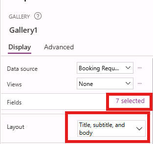
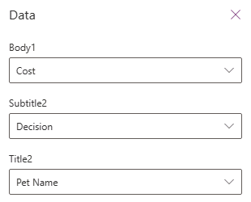

---
lab:
    title: 'Lab 2.1.: Create a canvas app'
    module: 'Module 2: Enhance Canvas Apps using Dataverse'
---

# Lab 2.1. – Create a canvas app

In this lab you will design and build a canvas app from blank, add a data source and a gallery.

## What you will learn

- How to create a canvas app with a gallery linked to a data source
- How to format fields with Power Fx formulas

## High-level lab steps

- Create a canvas app from blank
- Add a data source to the app
- Add a gallery to the app
- Configure the fields in the gallery
  
## Prerequisites

- Must have completed **Lab 1: Data model**

## Detailed steps

## Exercise 1 – Create a canvas app

### Task 1.1 - Create the app

1. Navigate to the Power Apps Maker portal `https://make.powerapps.com`

1. Make sure you are in the **JJTrainingEnvironment** environment.

1. Select the **+ Create** tab from the left navigation menu.

1. Select the **Start with a blank canvas** tile under **Create your apps**.

1. Select **Tablet size**.

1. Wait for the blank app to be built.

1. Select **Save** in the top-right of the Power Apps Studio, enter `Booking Request app`, and select **Save**.

### Task 1.2 - Add data source

1. In the app authoring menu, select **Data**.

    

1. Select the drop-down caret next to **Add data** and enter `Booking` in **Search**.

    

1. Select the **Booking Requests** Microsoft Dataverse table.

### Task 1.3 - Configure the main screen

1. In the app authoring menu, select **Tree view**.

1. Select **Screen1** in the tree view and select the ellipsis (**...**) and select **Rename**.

1. Enter `MainScreen`.

1. In the app authoring menu, select **Insert (+)**.

1. Select **Rectangle**.

1. Drag the rectangle to the top left of the screen.

1. In the app authoring menu, select **Tree view**.

1. Rename the rectangle to `HeaderRect`.

1. Set the properties of the rectangle in the formula bar as follows:

   1. X=`0`
   1. Y=`0`
   1. Height=`80`
   1. Width=`Parent.Width`

1. In the app authoring menu, select **Insert (+)**.

1. Select **Text label**.

1. Drag the label to the top left of the screen.

1. In the app authoring menu, select **Tree view**.

1. Rename the label to `HeaderLabel`.

1. Set the properties of the label in the formula bar as follows:

   1. X=`0`
   1. Y=`0`
   1. Height=`80`
   1. Width=`Parent.Width`
   1. Align=`Align.Center`
   1. Size=`24`
   1. Text=`"Booking Request"`
   1. Color=`Color.White`

    

1. Select **Save** in the top-right of the Power Apps Studio.

### Task 1.4 - Add a gallery

1. In the app authoring menu, select **Insert (+)**.

1. Select **Vertical gallery**.

    

1. Select **Booking Requests** for the data source.

    

1. In the **Properties** tab, for **Layout** select **Title, subtitle, and body**.

1. Select **7 selected** next to **Fields**.

1. Select **Cost** for **Body1**.

   > **NOTE:** The field names may show as schema names with a prefix isntead of the display name.

1. Select **Decision** for **Subtitle2**.

1. Select **Pet Name** for **Title2**.

    

1. Close the **Data** pane.

1. In the app authoring menu, select **Tree view**.

1. Rename the gallery to `BookingRequestList`.

1. If a suggestions popup dialog appears, select **Cancel**.

1. Set the properties of the gallery in the formula bar as follows:

   1. X=`0`
   1. Y=`80`
   1. Height=`575`
   1. Width=`250`

### Task 1.5 - Format the currency field

1. In the app authoring menu, select **Tree view**.

1. Expand the **BookingRequestList** gallery.

1. Select **Body1**.

    

1. Set the **Text** property in the formula bar to the formula:

    ```powerappsfl
    Text(Value(ThisItem.Cost), "$#,##0.00")
    ```

1. Select **Save** in the top-right of the Power Apps Studio.

1. Select the **<- Back** button from the top left of the command bar, and select **Leave** to exit the app.

## Congratulations!

You have created Canvas app using Dataverse table.